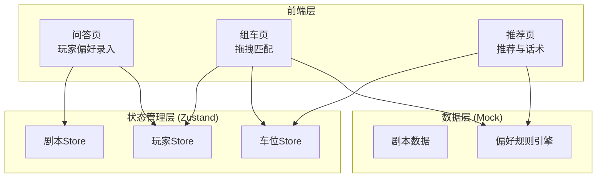
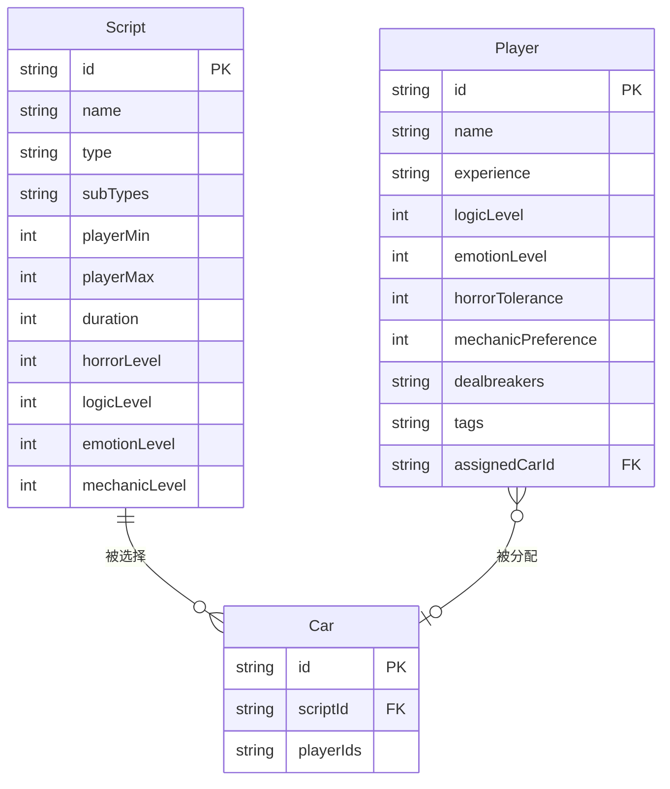

## 1. 架构设计



## 2. 技术说明

- **前端**：React@18 + TypeScript + Tailwind CSS@3 + Vite
- **初始化工具**：vite-init（react-ts 模板）
- **后端**：无（纯前端，数据存储在 Zustand + localStorage）
- **数据库**：无（Mock 数据内嵌前端）
- **状态管理**：Zustand
- **拖拽**：@dnd-kit/core + @dnd-kit/sortable（轻量级拖拽库）
- **图标**：lucide-react

## 3. 路由定义

| 路由 | 用途 |
|------|------|
| `/` | 重定向到 `/survey` |
| `/survey` | 问答页 - 剧本选择与玩家偏好录入 |
| `/matching` | 组车页 - 散客拖拽组车与冲突检测 |
| `/recommendation` | 推荐页 - 推荐说明与沟通话术 |

## 4. API 定义

无后端 API，所有数据通过 Zustand store 在前端管理。

### 4.1 数据接口定义

```typescript
interface Script {
  id: string;
  name: string;
  type: "本格" | "变格" | "社会派" | "情感" | "机制" | "恐怖";
  subTypes: string[];
  playerRange: [number, number];
  duration: number;
  tags: string[];
  horrorLevel: number;
  logicLevel: number;
  emotionLevel: number;
  mechanicLevel: number;
}

interface Player {
  id: string;
  name: string;
  experience: "新手" | "进阶" | "老手";
  preferences: {
    logicLevel: number;
    emotionLevel: number;
    horrorTolerance: number;
    mechanicPreference: number;
  };
  dealbreakers: string[];
  tags: string[];
  assignedCarId: string | null;
}

interface Car {
  id: string;
  scriptId: string;
  playerIds: string[];
  warnings: CarWarning[];
}

interface CarWarning {
  type: "conflict" | "suggestion" | "info";
  message: string;
}

interface Recommendation {
  carId: string;
  reasons: string[];
  risks: string[];
  scriptSuggestion: string;
  communicationScript: string;
}
```

## 5. 服务架构图

无后端服务

## 6. 数据模型

### 6.1 数据模型定义



### 6.2 数据定义

前端 Mock 数据，无需 DDL。剧本数据预置 12+ 个常见剧本，涵盖本格、变格、社会派、情感、机制、恐怖等类型。
